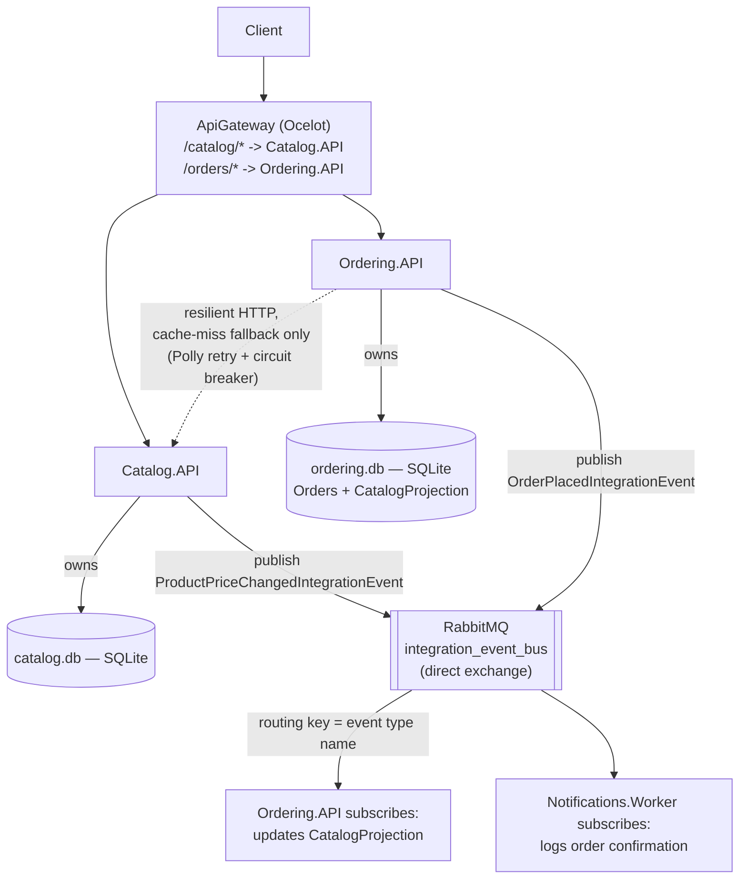

# Microservices Skeleton

A small, deliberately over-explained .NET microservices system: an API
Gateway (Ocelot), two bounded-context services each owning their own SQLite
database (Catalog, Ordering), an async event bus over RabbitMQ, and a
background worker that reacts to events it was never wired to directly.
Built to put six specific architectural decisions from Microsoft's
[.NET Microservices: Architecture for Containerized .NET Applications](https://learn.microsoft.com/en-us/dotnet/architecture/microservices/)
guide (the eShopOnContainers ebook) into running code, including one
decision built the "obvious but wrong" way on purpose, so the fix means
something. See the companion [.NET Microservices Field Guide](../dotnet-microservices-field-guide.html)
for the write-up of the source material this repo is built from.

## Problem

Reading about bounded contexts, API gateways, and "never call another
service synchronously" is one thing. The place those ideas actually get
tested is the moment two services both need the same piece of data and
disagree about who owns it — Ordering needs a product's name and price to
place an order, but Catalog owns that data. The easy, obvious thing to
write is `await httpClient.GetAsync("http://catalog-api/products/3")`
inside Ordering's order-placement endpoint. The guide's own Section 03 says
that's an anti-pattern for exactly this case. This repo builds the obvious
version, keeps it (as a resilient fallback, not the primary path), and
builds the actual fix next to it — a locally replicated projection kept
current by subscribing to Catalog's own domain events — so both the
temptation and the reason not to give in to it by default are visible in
the same codebase.

## Architecture



Four independently deployable pieces, three of them stateful in their own
right: Catalog.API and Ordering.API each own a SQLite file nobody else
touches directly, and RabbitMQ owns the durable queues that make the async
path survive a subscriber being briefly offline. `BuildingBlocks/EventBus`
is the one piece of code shared across services — infrastructure
(`IEventBus`, `IntegrationEvent`, the RabbitMQ implementation), never
domain shape.

## Decisions and trade-offs

**Two services, two databases, one word never uttered by either service
about the other's schema.** Catalog knows `Products`. Ordering knows
`Orders` and its own `CatalogProjection` — never Catalog's actual table.
This is Section 01's bounded-context point applied at the literal database
level: no shared schema, no shared migration, and if Catalog's internal
`Products` table grew a dozen columns tomorrow for its own reasons, nothing
in Ordering would need to change.

**The API Gateway strips the internal naming, on purpose.** Catalog.API
has never heard the word "catalog" — its own routes are just `/products`.
Ordering.API's own routes are root-relative (`/`, `/{id}`), not `/orders/*`.
The gateway (`ocelot.json`) is what decides a client sees `/catalog/products`
and `/orders/5` — matching Section 02's point that a gateway shapes the API
for the client, and downstream services don't have to agree on that shape
among themselves. It's also why Ocelot rather than Azure API Management:
this is a single-repo reference skeleton with no PaaS account behind it,
the same reason the source ebook's own eShopOnContainers sample picks
Ocelot — see the gateway's own `Dockerfile` comment for why that's the
right call here and the wrong one to copy verbatim into a real multi-team
production system.

**The synchronous call that shouldn't be the default path, kept anyway —
as a fallback.** `CatalogServiceClient.GetProductAsync` exists and is
wrapped in the field guide's exact resilience shape (6-attempt exponential
backoff, then a circuit breaker opening after 5 consecutive faults for
30s) precisely because Ordering's order-placement endpoint calls it. But
only on a `CatalogProjection` cache miss — see `ResolveProductAsync` in
`Ordering.API/Program.cs`. The primary path is Section 03's actual
prescription: Ordering subscribes to `ProductPriceChangedIntegrationEvent`
and keeps its own local copy of the (`ProductId`, `Name`, `Price`) it
needs, updated asynchronously, with zero request to Catalog at
order-placement time. The synchronous fallback only fires for a product
Ordering has never seen a price event for yet (freshly added, or Ordering
was offline when the event fired) — a real, defensible cache-aside pattern,
not a compromise nobody would actually ship.

**Fat integration events, deliberately.** `OrderPlacedIntegrationEvent`
carries `ProductName` and `UnitPrice`, not just IDs — the guide names this
exact "thin vs. fat" trade-off. A thin event would make
`Notifications.Worker` call back into Ordering or Catalog to compose a
confirmation message, which reintroduces the synchronous cross-service
dependency this whole design exists to avoid. Fat costs a slightly larger
message and a small amount of denormalization; thin costs the actual
architectural property being demonstrated.

**Publishing after the local commit, without an Outbox.** Both
`Catalog.API`'s price-update endpoint and `Ordering.API`'s order-placement
endpoint commit to SQLite first, then call `IEventBus.Publish`. If the
process crashes between those two lines, the domain change persists and
the event never goes out — a real, known gap. The guide names the
[Outbox pattern](https://www.kamilgrzybek.com/design/the-outbox-pattern/)
as the standard fix (write the event to a table in the same local
transaction, publish from that table afterward) and this repo doesn't
implement it — seeing exactly where that gap lives is more useful than
papering over it with a partial implementation. See "What I'd do
differently."

**A monorepo convenience that wouldn't survive contact with a real
multi-repo setup.** `Ordering.API` and `Notifications.Worker` both take a
project reference to the service whose event they consume
(`Catalog.API.Events`, `Ordering.API.Events`) so they can deserialize into
a real type. In a genuinely independent multi-repo microservices system
each consumer would carry its own copy of just the event contract it
depends on (a thin, versioned DTO), not a reference to the publisher's
whole project — this repo takes the shortcut because it's one solution
file demonstrating the pattern, not four separately deployed repos.

## Verification

No .NET SDK in the sandbox this repo was built in, so none of the C#
compiled or ran here — same honest position as the rest of this portfolio's
repos. What *did* run, for real:

**`verification/rabbitmq_topology_check.py`** — a throwaway Python/pika
script reimplementing `EventBusRabbitMQ.cs`'s exact wire-level shape (one
durable direct exchange, one durable queue per subscriber, bound with the
event's type name as the routing key) against a live RabbitMQ 3.12 broker,
checking the three properties the whole design depends on:

```
[PASS] ProductPriceChangedIntegrationEvent reaches the queue bound to its routing key
[PASS] ProductPriceChangedIntegrationEvent does NOT reach a queue bound to a different routing key
[PASS] OrderPlacedIntegrationEvent reaches the original subscriber (Notifications.Worker)
[PASS] OrderPlacedIntegrationEvent ALSO reaches a newly-added second subscriber, unmodified publisher
[PASS] Subscriber queue is declared durable (survives a broker restart)

ALL CHECKS PASSED
```

That third-from-last check is the concrete proof behind the "open/closed
principle" claim made throughout this README and the field guide: a second
subscriber queue was bound to `OrderPlacedIntegrationEvent` after the fact,
with no change to how the first message was published, and it received its
own copy of the same message.

**`tests/EventBus.Tests`** — xUnit tests against
`InMemoryEventBusSubscriptionsManager`, the one piece of the event bus with
zero RabbitMQ.Client dependency and therefore the one piece actually
unit-testable in isolation. Reviewed carefully, not run — no `dotnet test`
available here.

Everything else — the minimal APIs, the SQLite access, the Polly policies,
Ocelot's routing — is written and reviewed the way the rest of this
portfolio's uncompiled C# is: carefully, with the parts that *could* be
checked outside the .NET toolchain actually checked.

## Failure modes

| Failure | What happens | Why |
|---|---|---|
| Ordering places an order for a product Catalog doesn't have yet in its `CatalogProjection` | One resilient synchronous call to Catalog; a 404 if the product truly doesn't exist there either | Cache-aside fallback — see "Decisions and trade-offs" |
| Catalog is down when that fallback call fires, past retry+breaker limits | `503` with an honest `BrokenCircuitException`-derived message, not a generic 500 | Matches the field guide's own `BasketController` pattern for handling an open circuit in application code |
| Process crashes between committing a domain change and calling `Publish` | The domain change persists; the event is lost | No Outbox pattern in this skeleton — see "What I'd do differently" |
| A `RabbitMQEventBus` handler throws while processing a message | The message is `Nack`ed without requeue — dropped, not retried, not dead-lettered | No DLQ topology here; see [event-pipeline-skeleton](../event-pipeline-skeleton) (a separate portfolio repo) for retry/DLQ done properly — deliberately not re-solved here |
| RabbitMQ is briefly unreachable when a service starts | `DefaultRabbitMQPersistentConnection.TryConnect` retries with linear backoff, a handful of times, once at startup | Same docker-compose race the field guide names for SQL Server — a container's process starting isn't the same as its dependency being ready |

## What I'd do differently

The Outbox pattern is the single biggest gap — both publish-after-commit
call sites should write to an outbox table in the same transaction as the
domain change, with a separate poller doing the actual `IEventBus.Publish`,
closing the crash window named above. Handler failures need the same
retry/DLQ topology `event-pipeline-skeleton` already builds properly,
rather than the flat nack-and-drop here. Service-to-service auth (the
gateway currently forwards requests with no identity propagation at all)
and distributed tracing (a correlation ID that survives the
gateway→service→event-bus→worker hop) are both real production
requirements this skeleton skips to keep the architecture lesson
uncluttered. And the monorepo project-reference shortcut for event
contracts (see "Decisions and trade-offs") is the first thing to undo if
this were ever split into genuinely independent repos.

## Running it

```bash
docker compose up --build
curl http://localhost:5000/catalog/products
curl -X POST http://localhost:5000/orders \
     -H 'Content-Type: application/json' \
     -d '{"productId": 3, "quantity": 2}'
```

Watch `notifications-worker`'s container logs for the order-confirmation
line — that's `OrderPlacedIntegrationEvent` making it across the bus to a
service that was never called directly.

Faster edit-run loop while iterating on the .NET code (RabbitMQ in Docker,
everything else via `dotnet run`):

```bash
./scripts/run_local.sh
```

What's actually been run in this repo's own build process:

```bash
pip install pika
python3 verification/rabbitmq_topology_check.py
```

## Layout

```
src/
  BuildingBlocks/EventBus/   IEventBus, IntegrationEvent, InMemoryEventBusSubscriptionsManager,
                             EventBusRabbitMQ, DefaultRabbitMQPersistentConnection -- shared infra, not domain code
  Catalog.API/               owns Products (SQLite), publishes ProductPriceChangedIntegrationEvent
  Ordering.API/               owns Orders + CatalogProjection (SQLite), the cache-aside + resilient-fallback logic,
                              publishes OrderPlacedIntegrationEvent, subscribes to Catalog's price-change event
  Notifications.Worker/       subscribes to OrderPlacedIntegrationEvent, logs a confirmation -- added with zero
                              changes to Ordering.API
  ApiGateway/                 Ocelot -- ocelot.json is the entire routing table
tests/
  EventBus.Tests/             xUnit against the one dependency-free piece of the event bus
verification/
  rabbitmq_topology_check.py  live RabbitMQ pub/sub + routing-key + fan-out checks -- actually run
docker-compose.yml           RabbitMQ + all four services
scripts/run_local.sh         RabbitMQ in Docker, services via `dotnet run`
```
